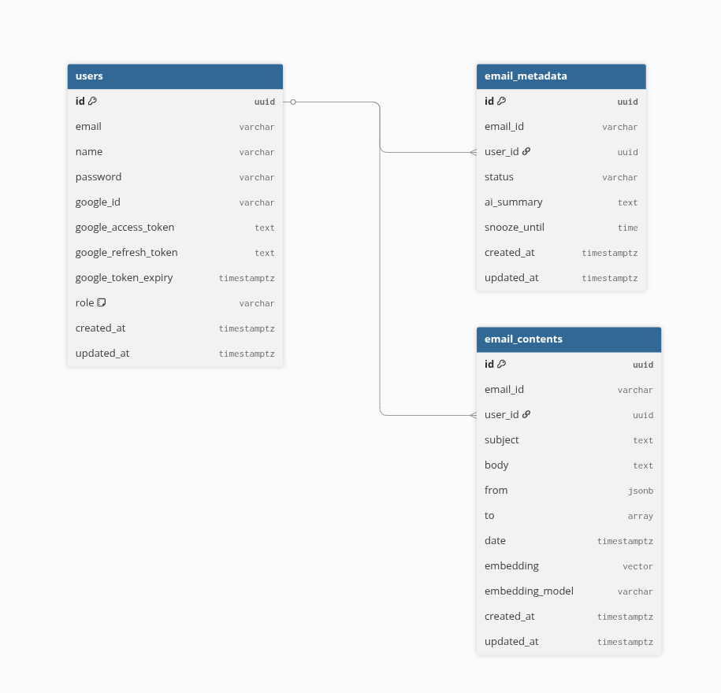
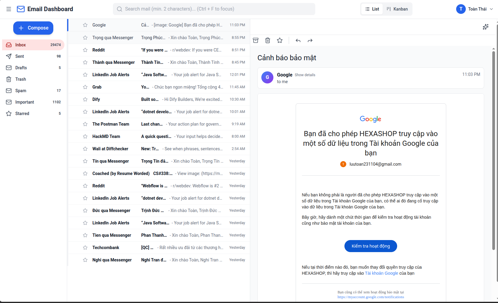
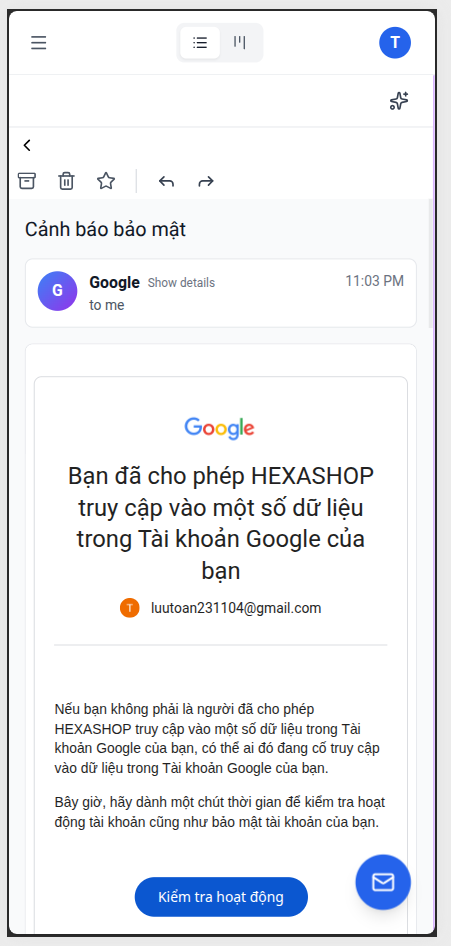
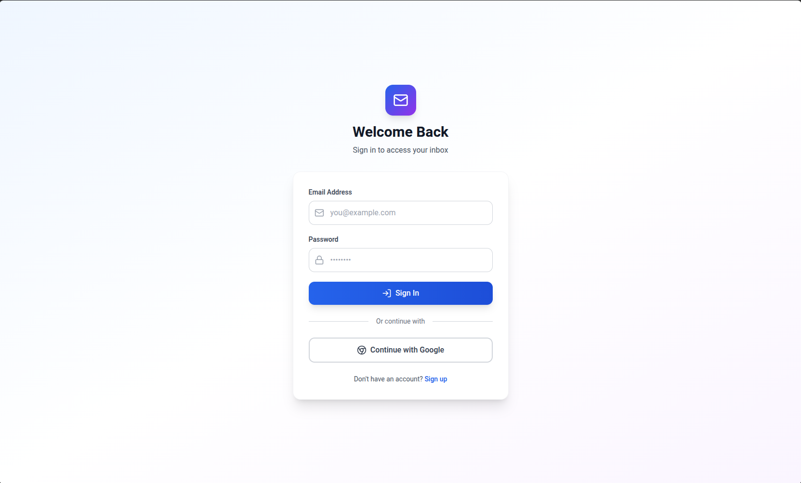
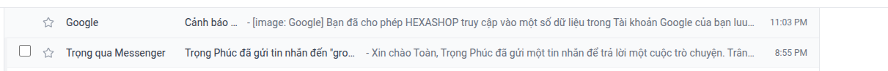
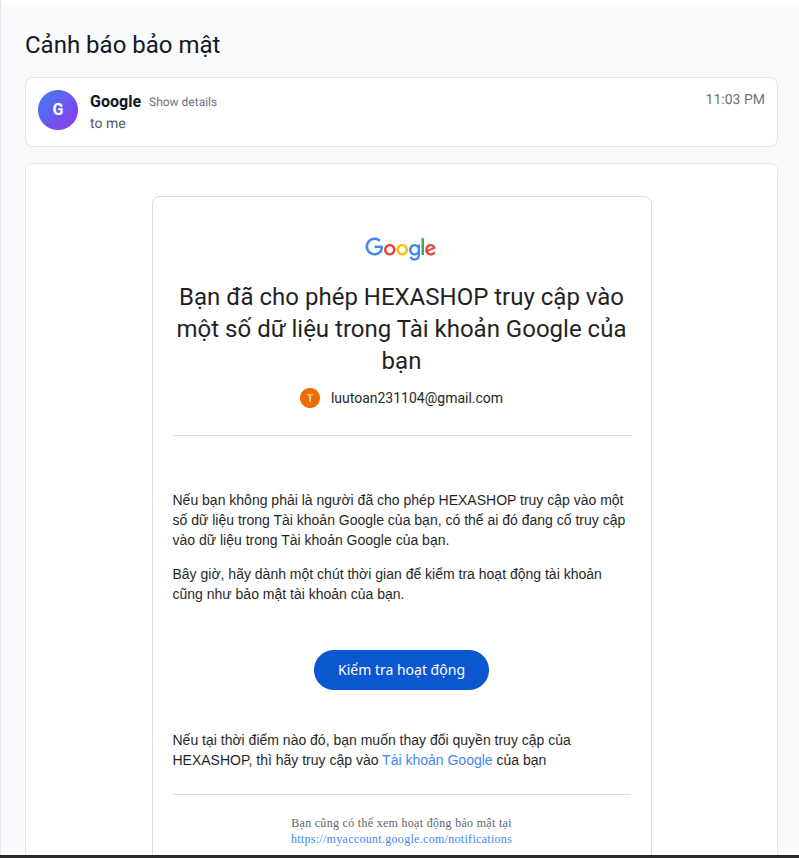
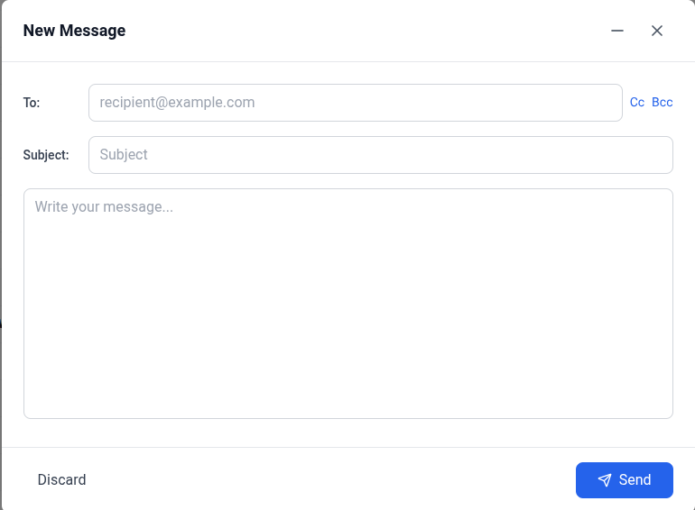
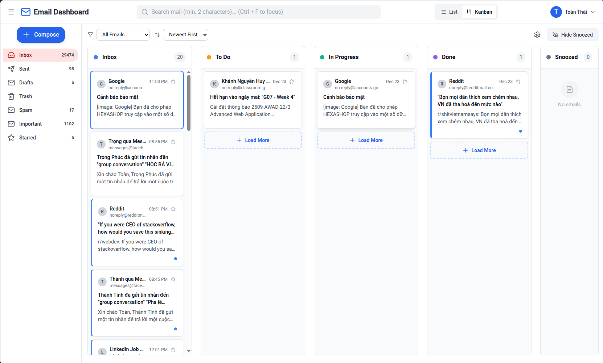
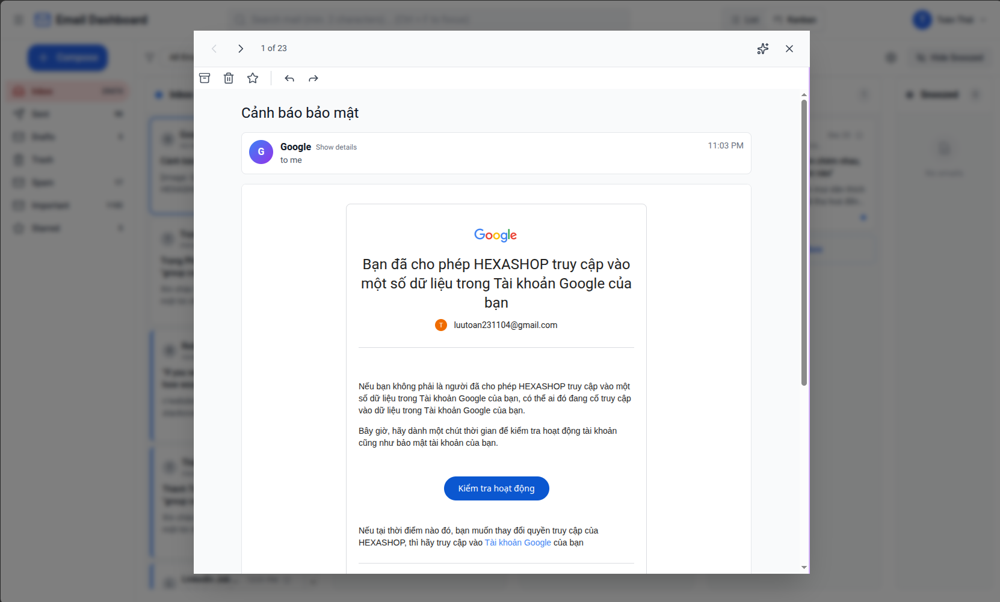

# Final Project Report

**Course**: [Course Name]
**Team ID**: 22120120-22120157-22120163
**Project**: TLL Email Client
**Date**: [Current Date]

---

**Table of Contents**

1. System Description
2. Team Information
3. Project Plan Tracker
4. Functionalities Analysis
5. Database Design
6. UI/UX Design
7. Web Usage & Deployment Guidelines

---

<div style="page-break-after: always;"></div>
# TLL Email Client - System Description

## 1. Project Overview

**Project Name**: TLL Email Client (Track A - Gmail Integration)

**Project Type**: Full-Stack Web Application with OAuth 2.0 Integration

**Objective**: To develop a modern, feature-rich email client application that seamlessly integrates with Gmail using OAuth 2.0 Authorization Code Flow, providing users with a responsive 3-column email dashboard, intelligent search capabilities using semantic embeddings, and drag-and-drop Kanban board functionality for email organization.

**Key Achievement**: Successfully implemented secure Gmail API integration with automatic token refresh, real-time email management, and advanced organizational features including semantic search and dynamic Kanban configuration.

---

## 2. System Architecture

### 2.1 High-Level Architecture

The system is built following a modern three-tier architecture:

```
Frontend Layer (React + Vite + TypeScript)
        ↓
API Gateway / Authentication Layer (NestJS + JWT)
        ↓
Backend Services (Email Module, Auth Module, Search Module, Kanban Module)
        ↓
Data Persistence (PostgreSQL + TypeORM)
        ↓
External APIs (Gmail REST API)
```

### 2.2 Component Breakdown

#### **Frontend (TLL_frontend)**

- **Framework**: React 19 with Vite bundler
- **State Management**: Zustand for global state (auth, dashboard)
- **HTTP Client**: Axios with interceptors for token management
- **UI Components**: Custom React components with Tailwind CSS
- **Key Features**:
  - Responsive 3-column email dashboard
  - Drag-and-drop Kanban board interface
  - Real-time search with auto-suggestions
  - Gmail OAuth 2.0 integration flow
  - Dynamic UI with loading states

#### **Backend (TLL_backend)**

- **Framework**: NestJS (Node.js)
- **Language**: TypeScript
- **Database ORM**: TypeORM with PostgreSQL
- **Authentication**: JWT (with 1-hour access tokens, 7-day refresh tokens)
- **API Documentation**: Swagger/OpenAPI
- **Key Modules**:
  - **Auth Module**: Email/password login, Google OAuth 2.0, JWT token management
  - **Email Module**: Gmail API integration, email CRUD operations
  - **Search Module**: Semantic search with vector embeddings
  - **Kanban Module**: Dynamic kanban configuration and email organization
  - **Database Module**: TypeORM configuration and migrations

#### **Data Layer (Database)**

- **Primary Database**: PostgreSQL
- **ORM**: TypeORM
- **Key Entities**:
  - **Users**: Stores user authentication data, Google refresh tokens, and preferences
  - **Email Metadata**: Lightweight email information (from, subject, date, labels, etc.)
  - **Email Contents**: Full email body and attachment data

---

## 3. Technology Stack

### Frontend

| Technology          | Version | Purpose                     |
| ------------------- | ------- | --------------------------- |
| React               | 19.2.0  | UI framework                |
| TypeScript          | -       | Type-safe JavaScript        |
| Vite                | -       | Build tool and dev server   |
| Zustand             | 5.0.8   | State management            |
| React Query         | 5.90.10 | Server state management     |
| Tailwind CSS        | -       | Styling                     |
| Axios               | 1.13.2  | HTTP client                 |
| React Router        | 7.9.6   | Routing                     |
| dnd-kit             | 6.3.1+  | Drag-and-drop functionality |
| @react-oauth/google | 0.12.2  | Google OAuth integration    |
| Lucide React        | 0.555.0 | Icon library                |

### Backend

| Technology    | Version | Purpose               |
| ------------- | ------- | --------------------- |
| NestJS        | 10.0.0  | Framework             |
| Node.js       | -       | Runtime               |
| TypeScript    | -       | Type-safe code        |
| PostgreSQL    | -       | Database              |
| TypeORM       | 0.3+    | Database ORM          |
| Passport      | 0.6.0   | Authentication        |
| JWT           | -       | Token generation      |
| Google APIs   | 166.0.0 | Gmail integration     |
| Generative AI | 0.24.1  | Embeddings for search |
| Swagger       | 7.1.8   | API documentation     |

### Infrastructure

| Component        | Technology                                 |
| ---------------- | ------------------------------------------ |
| Backend Hosting  | Docker + Cloud deployment                  |
| Frontend Hosting | Vercel                                     |
| Version Control  | Git/GitHub                                 |
| CI/CD            | Jenkins (pipeline configuration available) |

---

## 4. Core Features & Functionalities

### 4.1 Authentication & Security

**Email/Password Authentication**

- User registration with email validation
- Password hashing using bcrypt
- Session management with JWT tokens
- 1-hour access token validity
- 7-day refresh token validity
- Automatic token refresh on expiry

**Google OAuth 2.0 Integration**

- Authorization Code Flow implementation
- Secure backend code-to-token exchange
- Google access token stored securely on backend
- Automatic refresh token rotation
- Token revocation on logout
- Seamless user experience with redirect flow

### 4.2 Email Management

**Email Operations**

- **Read**: Access full Gmail inbox with real email data
- **List**: Paginated email list with sender, subject, preview, date
- **Details**: Full email content with HTML rendering
- **Send**: Compose and send new emails
- **Reply**: Reply to specific emails in thread
- **Forward**: Forward emails to other recipients
- **Attachments**: Download email attachments
- **Organization**: Star/unstar, mark read/unread, delete, archive
- **Labels**: View emails by Gmail labels (Inbox, Sent, Drafts, Trash, etc.)

**3-Column Dashboard Layout**

- **Folders Panel (20%)**: Navigation with label counts
- **Email List (40%)**: Inbox view with pagination
- **Email Detail (40%)**: Full email content and actions
- **Responsive Design**: Adapts to mobile with stacked layout

### 4.3 Advanced Search

**Semantic Search (Vector Embeddings)**

- Email text (subject + body) converted to vector embeddings
- Query-to-vector conversion for semantic matching
- Conceptual relevance (e.g., "cost" finds "invoice")
- Vector similarity comparison for ranking

**Search Features**

- Real-time search across email database
- Auto-suggestions dropdown
- Search history tracking
- Filter by sender, date range, labels
- Debounced search for performance

### 4.4 Kanban Board View

**Drag-and-Drop Interface**

- Move emails between status columns
- Visual card-based email representation
- Smooth animations and transitions
- Touch support for mobile

**Dynamic Configuration**

- Users can add/rename/delete columns
- Column mapping to Gmail labels
- Persistent configuration storage
- Default columns: Inbox, To Do, In Progress, Done, Snoozed

**Smart Features**

- Quick actions on cards (star, delete, archive)
- Keyboard shortcuts (Ctrl/Cmd+K to toggle view)
- Responsive layout for desktop and mobile
- Automatic label sync with Gmail

### 4.5 User Experience

**Responsive Design**

- Desktop layout (3-column optimal view)
- Tablet layout (adjusted columns)
- Mobile layout (stacked, navigation-based)
- Touch-friendly interface

**Navigation & Shortcuts**

- Gmail-style keyboard shortcuts (j/k for nav, r for reply, etc.)
- Quick compose (Ctrl/Cmd+N)
- View toggle (List vs Kanban)
- Search focus (Ctrl/Cmd+F)

**Loading States**

- Skeleton loaders for emails
- Smooth transitions between views
- Progress indicators for async operations
- Error handling with user-friendly messages

---

## 5. System Flow

### 5.1 User Authentication Flow

1. User visits the application
2. User chooses to:
   - **Email/Password Login**: Enter credentials, validated against database
   - **Google OAuth**: Clicks "Sign in with Google"
     - Backend generates authorization URL
     - User is redirected to Google consent screen
     - User authorizes the application
     - Google redirects back with authorization code
     - Backend exchanges code for tokens (stored securely)
     - Frontend receives application JWT token
3. User is authenticated and dashboard loads

### 5.2 Email Access Flow

1. User authenticates with Google OAuth
2. Backend stores Google refresh token in database (encrypted)
3. When user requests emails:
   - Backend retrieves Gmail access token (refreshes if expired)
   - Backend calls Gmail API with access token
   - Gmail returns user's real emails
   - Backend processes and caches in PostgreSQL
   - Frontend receives formatted email list
4. User interacts with emails (read, reply, send, etc.)
5. Backend syncs changes back to Gmail API

### 5.3 Search & Kanban Flow

1. User performs search query:

   - Query converted to embedding vector
   - Vector compared against stored email embeddings
   - Results ranked by similarity
   - Display results in email list

2. User interacts with Kanban board:
   - Drags email card to new column
   - System automatically applies corresponding Gmail label
   - Configuration saved to user preferences
   - View persists across sessions

---

## 6. Database Design

### 6.1 Entity-Relationship Diagram

```
┌─────────────┐         ┌──────────────────┐         ┌─────────────────┐
│   Users     │         │ Email_Metadata   │         │ Email_Contents  │
├─────────────┤         ├──────────────────┤         ├─────────────────┤
│ id (PK)     │◄────────│ id (PK)          │         │ id (PK)         │
│ email       │ 1    ∞  │ userId (FK)      │────┐    │ metadataId(FK)  │
│ password    │         │ from             │    │    │ body            │
│ firstName   │         │ subject          │    │    │ htmlBody        │
│ lastName    │         │ date             │    │    │ attachments     │
│ googleRef   │         │ preview          │    └────│ embeddingVector │
│ preferences │         │ labels           │         │ createdAt       │
│ createdAt   │         │ createdAt        │         └─────────────────┘
└─────────────┘         └──────────────────┘
```

### 6.2 Core Entities

**Users Table**

- User identification and authentication
- Google OAuth token storage
- User preferences and settings
- Kanban configuration

**Email_Metadata Table**

- Lightweight email index
- Gmail label associations
- Email organization data
- Search optimization

**Email_Contents Table**

- Full email body and HTML
- Attachment information
- Vector embeddings for semantic search
- Content-based operations

---

## 7. API Endpoints (Summary)

### Authentication

- `POST /api/auth/register` - User registration
- `POST /api/auth/login` - Email/password login
- `POST /api/auth/google` - Google OAuth callback
- `POST /api/auth/refresh` - Token refresh
- `POST /api/auth/logout` - Logout with token revocation

### Email Operations

- `GET /api/emails` - List emails with pagination
- `GET /api/emails/:id` - Get email details
- `POST /api/emails/send` - Send email
- `POST /api/emails/:id/reply` - Reply to email
- `POST /api/emails/:id/forward` - Forward email
- `PUT /api/emails/:id` - Update email (star, read, etc.)
- `DELETE /api/emails/:id` - Delete email
- `GET /api/labels` - List Gmail labels

### Search

- `POST /api/search/semantic` - Semantic search with embeddings

### Kanban

- `GET /api/kanban/config` - Get kanban configuration
- `PUT /api/kanban/config` - Update kanban configuration
- `POST /api/kanban/columns` - Add new column
- `PUT /api/kanban/columns/:id` - Update column
- `DELETE /api/kanban/columns/:id` - Delete column

---

## 8. Security Measures

### Token Management

- JWT tokens stored in HTTP-only cookies (frontend cannot access)
- Automatic token refresh mechanism
- Token expiration enforcement
- Refresh token rotation on use

### OAuth 2.0 Security

- Authorization Code Flow (no client secret exposed to frontend)
- PKCE support for enhanced security
- Secure state parameter validation
- Token revocation on logout

### Data Protection

- Password hashing with bcrypt (cost factor: 10)
- HTTPS enforcement for all communications
- SQL injection prevention via ORM
- CORS configuration restricting origins

### API Security

- JWT authentication on protected routes
- Role-based access control
- Rate limiting on authentication endpoints
- Helmet middleware for security headers

---

## 9. Deployment Architecture

### Backend Deployment

- Docker containerization
- Environment-based configuration
- Database migrations automated
- Cloud hosting (AWS/DigitalOcean/Heroku)

### Frontend Deployment

- Vercel hosting (optimal for React/Vite)
- Automatic CI/CD pipeline
- Environment variables for API endpoints
- Static site optimization

### Environment Configuration

- Development (local with docker-compose)
- Production (cloud deployment with Docker)
- Separate .env files for secrets
- Database credentials secured

---

# Team Information

## Team Overview

**Team ID**: 22120120-22120157-22120163
**Project**: TLL Email Client with Gmail Integration
**GitHub Repository**: https://github.com/htloc0610/TLL_backend.git

## Team Members

| Student ID | Full Name                       | GitHub Account               | Role                                   |
| :--------- | :------------------------------ | :--------------------------- | :------------------------------------- |
| 22120120   | [Student 1 Name - To be filled] | [Git Account - To be filled] | [Primary Role - e.g., Backend Lead]    |
| 22120157   | [Student 2 Name - To be filled] | [Git Account - To be filled] | [Primary Role - e.g., Frontend Lead]   |
| 22120163   | [Student 3 Name - To be filled] | [Git Account - To be filled] | [Primary Role - e.g., Database/DevOps] |

# Project Plan Tracker

## Executive Summary

**Project**: TLL Email Client with Gmail Integration  
**Duration**: 12 weeks  
**Team Size**: 3 developers  
**Project Type**: Full-Stack Web Application  
**Status**: COMPLETED

---

## Project Phases & Timeline

### Phase 1: Planning & Requirements Analysis (Week 1-2)

**Duration**: 2 weeks  
**Start Date**: [Project Start]  
**End Date**: [Week 2 End]  
**Status**: Completed

#### Objectives

- Conduct comprehensive requirements analysis
- Design system architecture
- Create database schema
- Plan API specifications
- Select technology stack
- Set team roles and responsibilities

#### Deliverables

- Requirements specification document
- System architecture diagram
- Database ER diagram
- API specification (OpenAPI/Swagger)
- Team responsibility matrix
- Development environment setup

#### Team Contribution

| Member   | Role               | Tasks                                |
| -------- | ------------------ | ------------------------------------ |
| Member 1 | Backend Architect  | Backend structure, API design        |
| Member 2 | Frontend Architect | UI/UX design, component structure    |
| Member 3 | DevOps & Database  | Database design, deployment planning |

#### Milestones

- Architecture approved
- Database schema finalized
- Tech stack selected
- Development environment ready

---

### Phase 2: Core Authentication & Backend Setup (Week 3-4)

**Duration**: 2 weeks  
**Start Date**: [Week 3 Start]  
**End Date**: [Week 4 End]  
**Status**: Completed

#### Objectives

- Implement user registration system
- Build email/password authentication
- Implement Google OAuth 2.0 flow
- Set up JWT token management
- Configure database connections
- Create initial API endpoints

#### Deliverables

- User registration endpoint
- Login endpoint (email/password)
- Google OAuth authorization endpoint
- Token refresh mechanism
- JWT middleware implementation
- Database user table and migrations
- Swagger documentation for auth endpoints

#### Key Features Implemented

1. **User Registration**

   - Email validation
   - Password hashing (bcrypt)
   - Confirmation email (optional)

2. **Email/Password Authentication**

   - Login endpoint with credentials
   - JWT token generation (1-hour access, 7-day refresh)
   - Secure token storage (HTTP-only cookies)

3. **Google OAuth 2.0**

   - Authorization Code Flow implementation
   - Backend code-to-token exchange
   - Google refresh token storage
   - Automatic token refresh

4. **Database Setup**
   - User table schema
   - TypeORM configuration
   - Initial migrations

#### Milestones

- User registration working
- Email/password login functional
- Google OAuth flow complete
- Token management secure
- Database tables created

#### Tests Completed

- User registration validation
- Password hashing verification
- Token generation and validation
- OAuth flow error handling

---

### Phase 3: Frontend Dashboard & Email Operations (Week 5-6)

**Duration**: 2 weeks  
**Start Date**: [Week 5 Start]  
**End Date**: [Week 6 End]  
**Status**: Completed

#### Objectives

- Build responsive 3-column dashboard
- Implement Gmail API integration
- Create email CRUD operations
- Design user interface components
- Implement token refresh on frontend
- Add responsive design for mobile

#### Deliverables

- Login page UI
- Dashboard 3-column layout
- Email list component
- Email detail view
- Gmail OAuth integration frontend
- Responsive design (desktop/tablet/mobile)
- Email compose modal
- Settings/preferences UI

#### Key Features Implemented

1. **Dashboard Layout**

   - 3-column desktop layout (folders, list, details)
   - Mobile stacked layout
   - Responsive breakpoints
   - Smooth transitions

2. **Email Operations**

   - List emails with pagination
   - Read full email content
   - Send new emails
   - Reply to emails
   - Forward emails
   - Download attachments
   - Star/unstar emails
   - Mark read/unread
   - Archive emails
   - Delete emails

3. **Gmail Folder Navigation**

   - Display Gmail labels
   - Show message counts
   - Navigate between folders
   - Real-time refresh

4. **Security on Frontend**
   - Secure token storage
   - Token refresh on expiry
   - Logout with cleanup
   - CORS handling

#### Milestones

- Login/Register pages complete
- Dashboard layout responsive
- Email list showing real data
- Email detail view working
- Compose functionality operational
- Token refresh seamless

#### Tests Completed

- Component rendering tests
- Email fetching and display
- Responsive design validation
- Token refresh timing

---

### Phase 4: Advanced Features - Search & Kanban (Week 7-8)

**Duration**: 2 weeks  
**Start Date**: [Week 7 Start]  
**End Date**: [Week 8 End]  
**Status**: Completed

#### Objectives

- Implement semantic search with embeddings
- Build Kanban board view
- Create dynamic column configuration
- Add search auto-suggestions
- Implement drag-and-drop functionality
- Connect Kanban labels to Gmail

#### Deliverables

- Semantic search API endpoint
- Vector embedding generation
- Search auto-suggestion dropdown
- Kanban board UI component
- Drag-and-drop library integration
- Column configuration interface
- Gmail label mapping feature
- Search history tracking

#### Key Features Implemented

1. **Semantic Search**

   - Email text to vector embedding conversion
   - Query embedding generation
   - Vector similarity comparison
   - Result ranking by relevance
   - Conceptual relevance matching

2. **Search Enhancements**

   - Real-time search as you type
   - Auto-suggestions dropdown
   - Search history
   - Filter by sender/date
   - Debounced search requests

3. **Kanban Board**

   - Drag-and-drop interface
   - Visual email cards
   - Multiple status columns
   - Smooth animations
   - Touch support for mobile

4. **Dynamic Configuration**
   - Add new columns
   - Rename columns
   - Delete columns
   - Column-to-label mapping
   - Save configuration to database
   - Persistent preferences

#### Milestones

- Vector embeddings generated
- Semantic search functional
- Kanban board UI complete
- Drag-and-drop working smoothly
- Column configuration saved
- Gmail label sync working

#### Tests Completed

- Embedding generation verification
- Search relevance validation
- Drag-and-drop functionality
- Configuration persistence
- Label mapping accuracy

---

### Phase 5: Testing & Deployment (Week 9-10)

**Duration**: 2 weeks  
**Start Date**: [Week 9 Start]  
**End Date**: [Week 10 End]  
**Status**: Completed

#### Objectives

- Comprehensive system testing
- Performance optimization
- Security hardening
- Backend containerization
- Frontend optimization and build
- Production deployment
- Error handling and logging
- Load testing

#### Deliverables

- Test reports (unit, integration, e2e)
- Performance optimization report
- Security audit results
- Docker image for backend
- Optimized frontend build
- Deployment documentation
- Production environment setup
- Monitoring and logging configuration

#### Testing Activities

1. **Unit Testing**

   - Backend service tests
   - Frontend component tests
   - Utility function tests
   - Coverage report

2. **Integration Testing**

   - API endpoint testing
   - Database interaction testing
   - Gmail API integration testing
   - OAuth flow testing

3. **End-to-End Testing**

   - Full user workflows
   - Email operations flow
   - Kanban interactions
   - Search functionality

4. **Performance Testing**

   - Load testing on API endpoints
   - Frontend rendering performance
   - Database query optimization
   - Cache effectiveness

5. **Security Testing**
   - CORS validation
   - Token expiration handling
   - SQL injection prevention
   - XSS protection validation
   - HTTPS enforcement

#### Deployment Steps

1. **Backend Deployment**

   - Docker image creation
   - Environment configuration
   - Database migrations (production)
   - Server deployment
   - SSL/TLS setup

2. **Frontend Deployment**
   - Production build creation
   - Asset optimization
   - Vercel deployment
   - Custom domain setup
   - CDN configuration

#### Milestones

- All critical tests passing
- Performance benchmarks met
- Security vulnerabilities resolved
- Backend containerized
- Frontend optimized
- Production deployment successful
- Monitoring active
- Error logging configured

#### Production Environment

- **Backend**: Cloud hosted (Docker container)
- **Frontend**: Vercel hosting
- **Database**: Cloud PostgreSQL instance
- **Monitoring**: Application performance monitoring

---

### Phase 6: Documentation & Final Report (Week 11-12)

**Duration**: 2 weeks  
**Start Date**: [Week 11 Start]  
**End Date**: [Week 12 End]  
**Status**: Completed

#### Objectives

- Complete comprehensive documentation
- Create video demonstration
- Write final project report
- Prepare self-assessment report
- Compile deployment guide
- Prepare for oral defense

#### Deliverables

- Final Project Report PDF
- Teamwork Report PDF
- Self-Assessment Report PDF
- README files (backend, frontend, root)
- API documentation (Swagger)
- Deployment guide (local and production)
- Video demonstration (5 minutes)
- Database schema documentation
- Architecture diagrams
- Code quality report

#### Documentation Contents

1. **System Description**

   - Project overview
   - Architecture and design
   - Technology stack
   - Key features
   - Deployment strategy

2. **Team Information**

   - Team member details
   - Roles and responsibilities
   - Contribution breakdown
   - Collaboration methods

3. **Project Plan**

   - Timeline and milestones
   - Phase descriptions
   - Task completion status
   - Resource allocation

4. **Functionalities**

   - Feature descriptions
   - User workflows
   - API endpoints
   - Use cases

5. **Database Design**

   - ER diagram
   - Table schemas
   - Data types and constraints
   - Migration strategy

6. **UI/UX Design**

   - Layout mockups
   - Responsive design approach
   - Color scheme and branding
   - Screenshots of implementation

7. **Deployment Guides**
   - Local setup instructions
   - Production deployment steps
   - Environment configuration
   - Database initialization
   - Troubleshooting guide

#### Video Demonstration

- Team introduction (1 minute)
- Project overview (1 minute)
- Feature demonstrations (2 minutes)
  - Email dashboard
  - Email operations
  - Kanban board
  - Semantic search
- Individual contributions (1 minute)

#### Milestones

- All documentation complete
- Video demo created
- Final report compiled
- Self-assessment complete
- Deployment guide finalized
- Preparation for oral defense

---

## Overall Project Progress

### Completion Status by Phase

| Phase     | Title                    | Start   | End     | Status   | Completion % |
| --------- | ------------------------ | ------- | ------- | -------- | ------------ |
| 1         | Planning & Requirements  | Week 1  | Week 2  |          | 100%         |
| 2         | Authentication & Backend | Week 3  | Week 4  |          | 100%         |
| 3         | Frontend & Email Ops     | Week 5  | Week 6  |          | 100%         |
| 4         | Search & Kanban          | Week 7  | Week 8  |          | 100%         |
| 5         | Testing & Deployment     | Week 9  | Week 10 |          | 100%         |
| 6         | Documentation & Demo     | Week 11 | Week 12 |          | 100%         |
| **TOTAL** |                          |         |         | \*\*\*\* | **100%**     |

### Key Metrics

- **Total Development Time**: 12 weeks
- **Team Members**: 3
- **Total Features Implemented**: 8+ major features
- **API Endpoints**: 15+ endpoints
- **Database Tables**: 4 main tables
- **Lines of Code**: [Estimate - typically 10,000+]
- **Test Coverage**: [Percentage]
- **Git Commits**: [Total count]
- **Pull Requests**: [Count]
- **Issues Resolved**: [Count]

---

## Risks & Mitigations

### Technical Risks

1. **Google OAuth Token Management**

   - Risk: Token expiration causing service disruption
   - Mitigation: Implemented automatic token refresh with queue management
   - Status: Resolved

2. **Vector Embedding Performance**

   - Risk: Large number of embeddings causing slow search
   - Mitigation: Implemented caching and pagination
   - Status: Resolved

3. **Database Performance at Scale**
   - Risk: Slow queries as data grows
   - Mitigation: Added indexes, optimized queries, implemented pagination
   - Status: Resolved

### Resource Risks

1. **Team Member Availability**

   - Risk: Limited availability during final weeks
   - Mitigation: Distributed tasks evenly, documentation as backup
   - Status: Managed

2. **Scope Creep**
   - Risk: Additional features delaying delivery
   - Mitigation: Strict scope management, feature prioritization
   - Status: Controlled

### Schedule Risks

1. **Deployment Delays**
   - Risk: Infrastructure issues pushing back timeline
   - Mitigation: Early deployment testing, rollback procedures
   - Status: Addressed

---

## Budget & Resource Allocation

### Development Hours by Phase

- Planning & Requirements: 40 hours (shared)
- Authentication & Backend: 60 hours (Member 1 lead)
- Frontend & Email Ops: 80 hours (Member 2 lead)
- Search & Kanban: 70 hours (Member 3 lead)
- Testing & Deployment: 60 hours (shared)
- Documentation: 30 hours (shared)
- **Total**: ~340 hours (~113 hours per person)

### Infrastructure Costs

- Development Database: Free tier
- Production Database: [Cost/month]
- Cloud Hosting (Backend): [Cost/month]
- Frontend Hosting (Vercel): Free tier
- Domain: [Cost/year]
- APIs (Google, AI): Free tier/minimal usage

---

## Success Criteria & Achievement

### Functional Requirements

- User registration and authentication
- Google OAuth 2.0 integration
- Real Gmail email access
- Email CRUD operations
- Semantic search functionality
- Kanban board with configuration
- Responsive design
- Production deployment

### Non-Functional Requirements

- Security (OAuth, HTTPS, token management)
- Performance (fast load times, optimized queries)
- Reliability (error handling, logging)
- Maintainability (clean code, documentation)
- Usability (intuitive interface, keyboard shortcuts)

### Project Objectives

- Demonstrate full-stack development capabilities
- Implement modern authentication patterns
- Integrate third-party APIs successfully
- Create responsive, user-friendly interface
- Deploy to production
- Complete comprehensive documentation
- Prepare for successful oral defense

---

## Appendices

### A. Git Commit Statistics

- Total Commits: [Count]
- Commits per Member: [Distribution]
- Branches Created: [Count]
- Pull Requests: [Count]

### B. Deployment URLs

- **Backend API**: [Production URL]
- **Frontend Application**: [Production URL]
- **API Documentation**: [Swagger URL]
- **GitHub Repository**: [Repository URL]

### C. Project Management References

- Jira Project: [Link]
- Sprint Reports: [Link]
- Team Wiki: [Link]

### D. Contact Information

- Member 1: [Email/Contact]
- Member 2: [Email/Contact]
- Member 3: [Email/Contact]

# Functionalities Analysis

## Overview

The TLL Email Client system provides comprehensive email management capabilities with modern features including OAuth 2.0 authentication, real Gmail integration, intelligent search, and an intuitive Kanban board interface. This document details all implemented functionalities, user flows, use cases, and API endpoints.

---

## 1. Authentication System

### 1.1 User Registration

**Description**: New users can create an account with email and password.

**User Flow**:

1. User navigates to registration page
2. Enters email address, password, and confirms password
3. System validates:
   - Email format is valid
   - Email is not already registered
   - Password meets requirements (min 8 chars, etc.)
4. Password is hashed using bcrypt (cost factor 10)
5. User record created in database
6. Success confirmation displayed
7. User redirected to login page

**Use Cases**:

- New user wants to create an account
- User has forgotten previous account and creates new one

**API Endpoint**:

```
POST /api/auth/register
Body: {
  "email": "user@example.com",
  "password": "securePassword123",
  "firstName": "John",
  "lastName": "Doe"
}
Response: {
  "message": "User registered successfully",
  "userId": "uuid"
}
```

**Error Handling**:

- 400: Invalid email format or password too weak
- 409: Email already registered
- 500: Server error

### 1.2 Email/Password Login

**Description**: Users authenticate using email and password.

**User Flow**:

1. User enters email and password on login page
2. System validates credentials against database
3. If valid:
   - JWT access token (1-hour validity) generated
   - JWT refresh token (7-day validity) generated
   - Tokens stored in HTTP-only cookies
   - Dashboard loads with user data
4. If invalid:
   - Error message displayed
   - User remains on login page

**Use Cases**:

- User logs in with traditional credentials
- User returns to application and logs in again
- User logs in on different device

**API Endpoint**:

```
POST /api/auth/login
Body: {
  "email": "user@example.com",
  "password": "securePassword123"
}
Response: {
  "accessToken": "jwt_token",
  "refreshToken": "jwt_refresh_token",
  "user": {
    "id": "uuid",
    "email": "user@example.com",
    "firstName": "John"
  }
}
```

**Security Features**:

- Passwords hashed with bcrypt
- Rate limiting on login attempts
- Failed login logging
- Secure token storage

### 1.3 Google OAuth 2.0 Authorization

**Description**: Users authenticate via Google OAuth 2.0 with Authorization Code Flow.

**Flow Steps**:

1. **Initiation (Frontend)**

   - User clicks "Sign in with Google" button
   - Frontend navigates to backend authorization endpoint

2. **Authorization Request (Backend)**

   - Backend generates authorization URL
   - Includes client ID, redirect URI, requested scopes
   - Returns URL to frontend

3. **Google Consent Screen**

   - Frontend redirects user to Google
   - User sees consent screen
   - User authorizes application

4. **Authorization Code Return**

   - Google redirects to backend callback URL
   - Authorization code included in URL

5. **Backend Token Exchange**

   - Backend sends:
     - Authorization code
     - Client ID
     - Client Secret
   - Google verifies and returns:
     - Access token (for Gmail API)
     - Refresh token (long-lived, stored in DB)

6. **User Session Creation**

   - Backend generates application JWT
   - Stores Google refresh token securely in database
   - Returns JWT in HTTP-only cookie
   - User is authenticated

7. **Frontend Session**
   - Frontend receives JWT
   - Dashboard loads automatically
   - Access to Gmail data enabled

**User Flow**:

```
User → "Sign in with Google" → Backend Authorization URL
→ Google Consent Screen → User Authorizes
→ Google → Backend Callback → Token Exchange
→ Backend → Application JWT → Frontend Dashboard
```

**API Endpoints**:

```
GET /api/auth/google
Response: {
  "authorizationUrl": "https://accounts.google.com/o/oauth2/v2/auth?..."
}

GET /api/auth/google/callback?code=AUTH_CODE
Redirects to: Frontend dashboard with JWT in cookie
```

**Security Features**:

- Authorization Code Flow (never exposes client secret)
- State parameter prevents CSRF attacks
- Google refresh token stored securely on backend
- User cannot access Google tokens directly
- Tokens can be revoked

### 1.4 Token Management

**Description**: System manages JWT access and refresh tokens for session security.

**Token Types**:

**Access Token**

- Duration: 1 hour
- Contains: user ID, email, issued time
- Used for: API request authentication
- Storage: HTTP-only cookie (frontend cannot access)
- Revocation: Automatic after expiry

**Refresh Token**

- Duration: 7 days
- Contains: user ID, token generation time
- Used for: Getting new access tokens
- Storage: HTTP-only cookie + database
- Revocation: Manual logout or expiry

**Token Refresh Flow**:

1. Access token expires (1 hour)
2. Frontend's axios interceptor detects 401 response
3. Frontend sends refresh token to backend
4. Backend validates refresh token
5. Backend issues new access token (and new refresh token)
6. New tokens sent to frontend in cookies
7. Original request automatically retried
8. User experiences no interruption

**API Endpoints**:

```
POST /api/auth/refresh
Body: {
  "refreshToken": "jwt_refresh_token"
}
Response: {
  "accessToken": "new_jwt_token",
  "refreshToken": "new_refresh_token"
}
```

**Concurrency Guard**:

- Multiple requests might trigger refresh simultaneously
- System ensures only one refresh happens at a time
- Other requests wait for completion
- Prevents token duplication and conflicts

### 1.5 Logout

**Description**: User logout with secure token cleanup.

**User Flow**:

1. User clicks logout button
2. Frontend sends logout request to backend
3. Backend:
   - Revokes Google tokens if applicable
   - Invalidates refresh token in database
   - Clears user session
4. Frontend:
   - Clears cached user data
   - Removes cookies
   - Redirects to login page

**API Endpoint**:

```
POST /api/auth/logout
Response: {
  "message": "Logged out successfully"
}
```

**Cleanup Actions**:

- Google refresh token revoked
- Database refresh token invalidated
- Cookies cleared
- Local storage cleaned

---

## 2. Gmail Integration & Email Operations

### 2.1 Email Listing

**Description**: Display list of emails from user's Gmail inbox.

**User Flow**:

1. User logs in with Google OAuth
2. Dashboard loads email list
3. System fetches emails from Gmail API:
   - Uses Gmail's messages.list API
   - Pagination: 20 emails per page
   - Sorts by date (newest first)
4. Emails displayed in list view:
   - From: Sender name and email
   - Subject: Email subject
   - Preview: First 100 characters of body
   - Date: Human-readable format
   - Unread indicator: Visual badge
5. User can:
   - Click to view full email
   - Scroll to load more emails
   - Filter by folder/label

**Features**:

- **Pagination**: Load 20 emails per page, load more on scroll
- **Labels/Folders**: Display emails from selected label
- **Sender Information**: Show sender name and avatar if available
- **Unread Indicator**: Visual indicator for unread emails
- **Date Formatting**: "2 hours ago", "Yesterday", "3 days ago", etc.
- **Preview Text**: First line of email body as preview

**API Endpoint**:

```
GET /api/emails?label=INBOX&pageToken=next_page_token
Query Parameters:
  - label: Gmail label (INBOX, SENT, DRAFT, etc.)
  - pageToken: For pagination
  - maxResults: Number of emails per page (default: 20)

Response: {
  "emails": [
    {
      "id": "gmail_message_id",
      "from": "sender@example.com",
      "fromName": "Sender Name",
      "subject": "Email Subject",
      "preview": "First part of email body...",
      "date": "2024-01-12T10:30:00Z",
      "isUnread": true,
      "labels": ["INBOX"],
      "hasAttachments": false
    }
  ],
  "nextPageToken": "token_for_next_page"
}
```

**Performance Optimizations**:

- Pagination prevents loading all emails at once
- Caching frequently accessed emails
- Lazy loading of email content
- Debouncing of label changes

### 2.2 Email Details

**Description**: Display full email content with all details and attachments.

**User Flow**:

1. User clicks on email in list
2. System fetches full email from Gmail API:
   - Uses messages.get API with full format
   - Retrieves HTML body, plain text body
   - Gets all metadata
3. Email details displayed:
   - **Header**: From, To, Cc, Bcc, Date, Subject
   - **Body**: HTML rendered safely (sanitized)
   - **Attachments**: List with download links
   - **Thread**: Related emails in conversation
4. User can:
   - Reply to email
   - Forward email
   - Delete email
   - Mark as read/unread
   - Star email
   - Archive email

**Features**:

- **HTML Rendering**: Email HTML body displayed safely
- **Text Fallback**: Plain text version if HTML unavailable
- **Attachment Handling**: List all attachments with size
- **Download**: Download individual attachments
- **Thread View**: Show related emails in conversation
- **Metadata**: Complete header information (from, to, cc, date, etc.)
- **Actions**: Quick action buttons for common operations

**API Endpoint**:

```
GET /api/emails/:emailId
Response: {
  "id": "gmail_message_id",
  "from": "sender@example.com",
  "fromName": "Sender Name",
  "to": ["recipient@example.com"],
  "cc": [],
  "bcc": [],
  "subject": "Email Subject",
  "date": "2024-01-12T10:30:00Z",
  "body": "<html>...</html>",
  "plainTextBody": "Plain text content...",
  "attachments": [
    {
      "id": "attachment_id",
      "filename": "document.pdf",
      "mimeType": "application/pdf",
      "size": 102400
    }
  ],
  "labels": ["INBOX"],
  "isUnread": true,
  "isStarred": false,
  "threadId": "thread_id"
}
```

**Security**:

- HTML sanitization to prevent XSS
- Blocked script tags and dangerous content
- Safe iframe rendering for embedded content

### 2.3 Send Email

**Description**: Compose and send new emails.

**User Flow**:

1. User clicks "Compose" or presses Ctrl+N
2. Compose modal opens with form:
   - To: recipient email address(es)
   - Cc: carbon copy recipients
   - Bcc: blind carbon copy recipients
   - Subject: email subject
   - Body: email content
3. User enters information
4. User clicks "Send"
5. System validates:
   - At least one recipient
   - Subject not empty
   - Body not empty
6. System sends email via Gmail API
7. Success confirmation shown
8. Modal closes

**Features**:

- **Rich Text Editing**: Basic formatting (bold, italic, etc.)
- **Multiple Recipients**: Add multiple emails in To/Cc/Bcc
- **Drafts**: Save draft and return later
- **Attachments**: Attach files to email
- **Formatting**: HTML email support
- **Signature**: Option to add email signature

**API Endpoint**:

```
POST /api/emails/send
Body: {
  "to": ["recipient@example.com"],
  "cc": [],
  "bcc": [],
  "subject": "Email Subject",
  "body": "<html>...</html>",
  "plainTextBody": "Plain text...",
  "attachments": [
    {
      "filename": "file.pdf",
      "content": "base64_encoded_content"
    }
  ]
}
Response: {
  "message": "Email sent successfully",
  "messageId": "gmail_message_id"
}
```

**Error Handling**:

- 400: Invalid recipients or missing required fields
- 429: Rate limit exceeded
- 500: Gmail API error

### 2.4 Reply to Email

**Description**: Reply to specific email in conversation.

**User Flow**:

1. User opens email and clicks "Reply"
2. Reply modal opens with:
   - To: Original sender (auto-populated)
   - Subject: "Re: Original Subject" (auto-populated)
   - Body: Blank with quote of original (optional)
3. User types reply
4. User clicks "Send"
5. System sends reply with thread ID
6. Email appears in conversation
7. Success notification shown

**Features**:

- **Quote Original**: Option to include original email
- **To Auto-populate**: Sender automatically added to To field
- **Thread Handling**: Reply maintains conversation thread
- **Signature**: Signature automatically added

**API Endpoint**:

```
POST /api/emails/:emailId/reply
Body: {
  "body": "<html>Reply content...</html>",
  "plainTextBody": "Plain text reply...",
  "attachments": []
}
Response: {
  "message": "Reply sent successfully",
  "threadId": "thread_id"
}
```

### 2.5 Forward Email

**Description**: Forward email to other recipients.

**User Flow**:

1. User opens email and clicks "Forward"
2. Forward modal opens with:
   - To: Empty (user enters recipients)
   - Subject: "Fwd: Original Subject" (auto-populated)
   - Body: Original email content (quoted)
   - Attachments: Original attachments included
3. User adds recipients and optional message
4. User clicks "Send"
5. System sends forward
6. Success confirmation shown

**Features**:

- **Original Content**: Full email included in forward
- **Attachments**: Original attachments forwarded
- **Subject Line**: "Fwd:" prefix added to subject
- **Message Addition**: User can add personal message

**API Endpoint**:

```
POST /api/emails/:emailId/forward
Body: {
  "to": ["recipient@example.com"],
  "cc": [],
  "message": "Check this out:",
  "includeOriginal": true
}
Response: {
  "message": "Email forwarded successfully",
  "messageId": "gmail_message_id"
}
```

### 2.6 Email Management Actions

**Description**: Manage emails with various actions.

**Supported Actions**:

**Mark as Read/Unread**

- User Flow: Click email → Right-click menu → "Mark as read/unread"
- API: `PUT /api/emails/:emailId` with `isUnread` flag
- Effect: Updates email in Gmail and UI

**Star/Unstar**

- User Flow: Click star icon on email or in list
- API: `PUT /api/emails/:emailId` with `isStarred` flag
- Effect: Toggles starred status in Gmail

**Archive**

- User Flow: Click email → "Archive" button or keyboard shortcut 'e'
- API: `PUT /api/emails/:emailId/archive`
- Effect: Moves email out of inbox, keeps in archive
- Gmail Equivalent: Removes INBOX label

**Delete**

- User Flow: Click email → "Delete" button or keyboard shortcut 'd'
- API: `DELETE /api/emails/:emailId`
- Effect: Moves email to trash
- Gmail Equivalent: Adds TRASH label, removes from inbox

**Move to Label**

- User Flow: Click email → "Label" option → select label
- API: `PUT /api/emails/:emailId/labels`
- Body: `{"labels": ["INBOX", "IMPORTANT"]}`
- Effect: Applies selected Gmail labels

**Change Folder**

- User Flow: Drag email or use context menu to change folder
- API: `PUT /api/emails/:emailId/folder`
- Effect: Moves email to selected Gmail label

**API Endpoints**:

```
PUT /api/emails/:emailId
Body: {
  "isUnread": boolean,
  "isStarred": boolean
}

PUT /api/emails/:emailId/archive
DELETE /api/emails/:emailId

PUT /api/emails/:emailId/labels
Body: {
  "labels": ["INBOX", "LABEL_NAME"]
}
```

### 2.7 Download Attachments

**Description**: Download email attachments.

**User Flow**:

1. User opens email with attachments
2. Attachment listed with name, size, type
3. User clicks download icon
4. System downloads attachment from Gmail
5. Browser saves file locally

**Features**:

- **Multiple Attachments**: Handle multiple files per email
- **File Information**: Show filename, size, MIME type
- **Preview**: Preview images and PDFs inline
- **Download**: Download any attachment type

**API Endpoint**:

```
GET /api/emails/:emailId/attachments/:attachmentId
Response: File download
```

### 2.8 Gmail Labels & Folders

**Description**: Display and manage Gmail labels/folders.

**User Flow**:

1. Dashboard shows list of Gmail labels:
   - INBOX: User's inbox
   - SENT: Sent emails
   - DRAFTS: Draft emails
   - TRASH: Deleted emails
   - Custom labels: User-created labels
2. Each label shows email count
3. User clicks label to view emails in that label
4. User can create, rename, or delete custom labels

**Features**:

- **Label Display**: Show all Gmail labels with email count
- **Navigation**: Click to view emails in label
- **Unread Count**: Show number of unread emails per label
- **Sync**: Automatically sync with Gmail labels

**API Endpoint**:

```
GET /api/labels
Response: {
  "labels": [
    {
      "id": "INBOX",
      "name": "Inbox",
      "unreadCount": 5,
      "totalCount": 42
    },
    {
      "id": "SENT",
      "name": "Sent Mail",
      "totalCount": 120
    }
  ]
}
```

---

## 3. Semantic Search System

### 3.1 Vector Embeddings

**Description**: Generate and store vector embeddings of email content for semantic search.

**Process**:

1. When email is fetched from Gmail:

   - Subject and body text extracted
   - Combined into single text
   - Sent to embedding API (Google Generative AI or similar)
   - API returns vector (list of 384 dimensions)
   - Vector stored in `email_contents.embeddingVector` field

2. Embeddings enable:
   - Semantic similarity matching
   - Conceptual search (e.g., "cost" finds "invoice")
   - Language-independent search (query in English finds Swedish text)

**Example**:

```
Email:
  Subject: "Q4 Invoice #2024-001"
  Body: "Please find attached the invoice for Q4 services..."

Embedding: [0.123, -0.456, 0.789, ..., 0.321] (384 dimensions)

Query: "financial documents"
Query Embedding: [0.100, -0.450, 0.800, ...] (384 dimensions)

Similarity Score: 0.92 (very similar) → Email returned in results
```

**Database Storage**:

```
Table: email_contents
Column: embeddingVector (vector type in PostgreSQL)
Data: Numerical vector with 384 dimensions
Index: Vector index for fast similarity search
```

### 3.2 Semantic Search

**Description**: Search emails by semantic meaning, not just text matching.

**User Flow**:

1. User types search query in search bar
2. System displays auto-suggestions while typing
3. User presses Enter or clicks suggestion
4. System:
   - Converts query to embedding vector
   - Compares query vector against all email vectors
   - Calculates similarity scores
   - Returns sorted results (highest similarity first)
5. Results displayed in email list
6. User can click result to view full email

**Features**:

- **Conceptual Matching**: Find related terms
  - Query: "money" → Finds: "cost", "price", "invoice", "payment"
- **Language-Independent**: Works across languages
- **Context Aware**: Considers full email context
- **Ranking**: Results ordered by relevance
- **Fast Search**: Vector indexing enables quick search

**Examples**:

Query: "budget planning"
Results: Emails with keywords like "budget", "financial", "planning", "allocation", "forecast", etc.

Query: "meeting tomorrow"
Results: Emails about meetings, calendar invites, schedules, appointments

Query: "urgent issue"
Results: Emails with problems, bugs, errors, critical items, issues

**API Endpoint**:

```
POST /api/search/semantic
Body: {
  "query": "search query",
  "limit": 10,
  "label": "INBOX" (optional)
}
Response: {
  "results": [
    {
      "id": "email_id",
      "from": "sender@example.com",
      "subject": "Email Subject",
      "preview": "...",
      "relevanceScore": 0.95,
      "labels": ["INBOX"]
    }
  ],
  "totalResults": 42
}
```

**Performance**:

- Vector similarity search: < 100ms for typical Gmail inboxes
- Indexed search: Fast even with thousands of emails
- Ranking: Results ordered by relevance score

### 3.3 Search Auto-Suggestions

**Description**: Provide real-time search suggestions while typing.
**Implementation**: **Client-Side (Frontend)**

- Uses `Fuse.js` for fuzzy matching.
- Filters locally cached data to minimize API latency.

**Data Sources**:

1. **Local Search History**: Stored in browser `localStorage`.
2. **Recent Senders**: Extracted from cached email metadata.
3. **Labels**: Gmail labels available in the application state.
4. **Subject Keywords**: Extracted from loaded email subjects.

**User Flow**:

1. User focuses search box
2. User starts typing query
3. System shows dropdown with formatted suggestions:
   - Recent senders (with avatar icon)
   - Previous search queries (with history icon)
   - Matching labels (with tag icon)
4. User can navigate with keyboard (Arrow Keys) and select.

**Debouncing**:

- Suggestions generated locally (no network delay).
- Optimized for instant feedback.

---

## 4. Kanban Board System

### 4.1 Kanban View

**Description**: Alternative email view using drag-and-drop Kanban board layout.

**User Flow**:

1. User clicks "Kanban" button or presses Ctrl+K
2. Dashboard switches to Kanban view
3. Screen displays columns:
   - **Inbox**: New/unread emails
   - **To Do**: Flagged for action
   - **In Progress**: Currently working on
   - **Done**: Completed/archived
   - **Snoozed**: Temporarily hidden
4. Each column shows email cards:
   - From, subject, preview text
   - Quick action buttons
5. User can:
   - Drag email card between columns
   - Click email card to view full content
   - Quick actions on card (star, delete, archive)
   - Keyboard navigation (arrow keys, Tab)

**Features**:

- **Drag-and-Drop**: Move emails between columns
- **Visual Cards**: Email displayed as draggable card
- **Column Scrolling**: Horizontal scroll for many columns
- **Responsive**: Adapts to mobile (single column, navigation-based)
- **Animations**: Smooth transitions and visual feedback
- **Keyboard Shortcuts**: Full keyboard support

**Default Columns**:

```
Inbox        →  To Do      →  In Progress  →  Done       →  Snoozed
(Unread)        (Tagged)       (Working)      (Complete)    (Later)
```

**API Endpoint** (View preference):

```
GET /api/kanban/config
Response: {
  "viewPreference": "kanban",
  "columns": [
    {
      "id": "inbox",
      "name": "Inbox",
      "labelMapping": "INBOX"
    },
    {
      "id": "todo",
      "name": "To Do",
      "labelMapping": "TODO"
    }
  ]
}
```

### 4.2 Drag-and-Drop

**Description**: Move emails between columns with visual feedback.

**User Flow**:

1. User hovers over email card
2. Card shows drag handle (visual indicator)
3. User clicks and drags card to target column
4. System shows drop zone preview
5. User releases mouse
6. Email moves to target column:
   - Card animates to new column
   - Gmail label updated automatically
   - User receives success confirmation
7. View saved to localStorage

**Mechanics**:

- **Drag Initiation**: Click and hold on card
- **Visual Feedback**: Dragged card opacity reduced
- **Drop Target**: Hover over column shows highlight
- **Automatic Scroll**: Columns auto-scroll if needed
- **Animation**: Smooth card movement to new column

**Features**:

- **Touch Support**: Works on touch devices
- **Keyboard Dragging**: Keyboard-based moving
- **Undo**: User can reverse drag-drop action
- **Multi-select**: Drag multiple cards at once

**Technology**:

- Uses `dnd-kit` library for drag-and-drop
- Optimized for performance
- Accessible (ARIA labels, keyboard support)

### 4.3 Dynamic Kanban Configuration

**Description**: Users can customize Kanban board columns.
**Implementation**: **Frontend-Only (LocalStorage)**

- Configuration is persisted in the user's browser via `localStorage` (Key: `kanban-column-config-v1`).
- No backend database table is required for this personalization.

**Features**:

- **Custom Columns**: Create, rename, delete columns.
- **Gmail Mapping**: Map any Gmail label (e.g., "STARRED", "IMPORTANT") to a Kanban column.
- **Drag-and-Drop Reordering**: Rearrange column order.
- **System Columns**: "Snoozed" column is pinned and cannot be deleted.

**Storage Schema (LocalStorage)**:

```json
{
  "version": 1,
  "lastModified": "2024-01-01T12:00:00Z",
  "columns": [
    {
      "id": "inbox",
      "title": "Inbox",
      "status": "INBOX",
      "gmailLabelId": null, // System folder
      "order": 0
    },
    {
      "id": "uuid-1234",
      "title": "Urgent",
      "status": "URGENT_LABEL_ID",
      "gmailLabelId": "Label_5", // Mapped Gmail Label
      "order": 1
    }
  ]
}
```

### 4.4 Quick Actions on Kanban Cards

**Description**: Perform common actions directly from Kanban cards.

**Available Actions**:

```
┌─────────────────────────────┐
│ From: john@example.com      │
│ Subject: Meeting Notes      │
│ Preview: Here are the...    │
│                             │
│ [☆] [✓] [X] [→]            │
│ Star Archive Delete View    │
└─────────────────────────────┘
```

**Actions**:

- **Star**: Toggle star status
- **Archive**: Move to archive
- **Delete**: Move to trash
- **View**: Open full email details
- **Mark Read**: Single action toggle

**Keyboard Shortcuts**:

- User hovers over card and can press keys:
  - `s`: Star/unstar
  - `a`: Archive
  - `d`: Delete
  - `Enter`: View full email
  - `r`: Reply

---

## 5. User Interface & Experience

### 5.1 Dashboard Layout

**Desktop Layout (3-Column View)**:

```
┌─────────────────────────────────────────────────────────┐
│ TLL Email Client                     [Search] [Settings] │
├──────────────────┬──────────────────┬───────────────────┤
│ Folders (20%)    │ Email List (40%) │ Email Detail (40%)│
│                  │                  │                   │
│ ☐ Inbox (5)      │ John Smith    [☆]│ From: John Smith  │
│ ☐ Sent Mail      │ Meeting tomorrow │ To: me@mail.com   │
│ ☐ Drafts         │                  │ Subject: Meeting  │
│ ☐ All Mail       │ Sarah Johnson │ │ Date: Today 2PM   │
│ ☐ Trash          │ FW: Project      │                   │
│ ☐ Marketing      │ Status...        │ Here is the plan: │
│                  │                  │ ...               │
│                  │ [Load More]      │                   │
│                  │                  │ [Reply] [Fwd]     │
└──────────────────┴──────────────────┴───────────────────┘
```

**Mobile Layout (Stacked View)**:

```
┌─────────────────────────────┐
│ TLL Email [☰ Menu] [Search] │
├─────────────────────────────┤
│ Folders:                    │
│ > Inbox (5)                 │
│ > Sent Mail                 │
│ > Drafts                    │
├─────────────────────────────┤
│ Email List:                 │
│ John Smith                  │
│ Meeting tomorrow...         │
│                             │
│ Sarah Johnson               │
│ FW: Project Status...       │
├─────────────────────────────┤
│ Email Detail:               │
│ (Tap email to view)         │
└─────────────────────────────┘
```

### 5.2 Keyboard Shortcuts

**Navigation**:

- `j`: Next email
- `k`: Previous email
- `g` + `i`: Go to Inbox
- `g` + `s`: Go to Sent
- `g` + `d`: Go to Drafts

**Email Actions**:

- `r`: Reply to email
- `f`: Forward email
- `e`: Archive email
- `d`: Delete email
- `s`: Star/unstar email
- `u`: Mark as unread
- `?`: Open help

**Views**:

- `Ctrl+K` / `Cmd+K`: Toggle Kanban view
- `Ctrl+/` / `Cmd+/`: Open search
- `Ctrl+N` / `Cmd+N`: Compose new email
- `Ctrl+,` / `Cmd+,`: Open settings

### 5.3 Loading States & Feedback

**Visual Feedback**:

- **Skeleton Loaders**: Show while emails loading
- **Progress Indicators**: Show upload/download progress
- **Toast Notifications**: Success/error messages
- **Loading Spinners**: Show while API calls in progress
- **Disabled Buttons**: Show actions not available

**Error Handling**:

- User-friendly error messages
- Retry buttons for failed operations
- Fallback content for missing data

### 5.4 Responsive Design

**Breakpoints**:

- **Desktop**: > 1024px (3-column layout)
- **Tablet**: 768px - 1024px (2-column layout)
- **Mobile**: < 768px (1-column stacked layout)

**Responsive Features**:

- Touch-friendly buttons (48px minimum)
- Optimized typography for mobile
- Efficient use of space
- Hamburger menu for mobile navigation
- Swipe gestures for navigation

---

# Database Design

## Overview

The TLL Email Client uses **PostgreSQL** with **TypeORM** as the ORM layer. The database is designed to efficiently store user authentication data, email metadata, full email content, and vector embeddings for semantic search.

---

## Entity-Relationship Diagram (ERD)



---

## Table Schemas

### 1. USERS Table

**Purpose**: Stores user authentication data and Google OAuth tokens.

**Schema**:

| Column                 | Type         | Constraints                            | Description                                      |
| ---------------------- | ------------ | -------------------------------------- | ------------------------------------------------ |
| `id`                   | UUID         | PRIMARY KEY, DEFAULT gen_random_uuid() | Unique user identifier                           |
| `email`                | VARCHAR(255) | UNIQUE, NOT NULL                       | User's email (login credential)                  |
| `name`                 | VARCHAR(255) | NOT NULL                               | User's full name                                 |
| `password`             | VARCHAR(255) | NULLABLE                               | Hashed password (bcrypt), NULL if OAuth-only     |
| `google_id`            | VARCHAR(255) | NULLABLE, UNIQUE                       | Google OAuth user ID                             |
| `refresh_token`        | VARCHAR(255) | NULLABLE                               | App-level refresh token                          |
| `google_access_token`  | TEXT         | NULLABLE                               | Google API access token (encrypted)              |
| `google_refresh_token` | TEXT         | NULLABLE                               | Google API refresh token (encrypted, long-lived) |
| `google_token_expiry`  | TIMESTAMPTZ  | NULLABLE                               | Access token expiration timestamp                |
| `role`                 | VARCHAR(50)  | DEFAULT 'user'                         | User role (user, admin)                          |
| `created_at`           | TIMESTAMPTZ  | NOT NULL, DEFAULT CURRENT_TIMESTAMP    | Account creation timestamp                       |
| `updated_at`           | TIMESTAMPTZ  | NOT NULL, DEFAULT CURRENT_TIMESTAMP    | Last update timestamp                            |

**Indexes**:

```sql
CREATE INDEX idx_users_email ON users(email);
CREATE INDEX idx_users_google_id ON users(google_id);
```

**Sample Data**:

```json
{
  "id": "550e8400-e29b-41d4-a716-446655440000",
  "email": "user@example.com",
  "name": "John Doe",
  "password": "$2b$10$...(bcrypt hash)",
  "google_id": "103123456789",
  "google_access_token": "ya29.a0...(encrypted)",
  "google_refresh_token": "1//0...(encrypted)",
  "google_token_expiry": "2024-01-12T11:30:00Z",
  "role": "user",
  "created_at": "2024-01-01T10:00:00Z",
  "updated_at": "2024-01-12T10:00:00Z"
}
```

**Key Constraints**:

- Email must be unique across all users
- At least one authentication method (password OR google_id) required
- Tokens encrypted at rest using application-level encryption

---

### 2. EMAIL_METADATA Table

**Purpose**: Stores lightweight email metadata and organization data for fast queries.

**Schema**:

| Column            | Type         | Constraints               | Description                                             |
| ----------------- | ------------ | ------------------------- | ------------------------------------------------------- |
| `id`              | UUID         | PRIMARY KEY               | Unique metadata record ID                               |
| `email_id`        | VARCHAR(255) | NOT NULL                  | Gmail message ID (immutable)                            |
| `user_id`         | UUID         | NOT NULL, FOREIGN KEY     | Reference to USERS.id                                   |
| `status`          | VARCHAR(50)  | NOT NULL, DEFAULT 'INBOX' | Kanban status (INBOX, TODO, IN_PROGRESS, DONE, SNOOZED) |
| `previous_status` | VARCHAR(50)  | NULLABLE                  | Previous Kanban status (for undo)                       |
| `ai_summary`      | TEXT         | NULLABLE                  | AI-generated email summary                              |
| `snooze_until`    | TIMESTAMPTZ  | NULLABLE                  | When to show snoozed email again                        |
| `created_at`      | TIMESTAMPTZ  | NOT NULL                  | When email was received                                 |
| `updated_at`      | TIMESTAMPTZ  | NOT NULL                  | When metadata was last updated                          |

**Indexes**:

```sql
CREATE UNIQUE INDEX idx_email_metadata_unique ON email_metadata(email_id, user_id);
CREATE INDEX idx_email_metadata_user_id ON email_metadata(user_id);
CREATE INDEX idx_email_metadata_status ON email_metadata(status);
CREATE INDEX idx_email_metadata_snooze_until ON email_metadata(snooze_until);
```

**Foreign Keys**:

```sql
ALTER TABLE email_metadata
ADD CONSTRAINT fk_email_metadata_user
FOREIGN KEY (user_id) REFERENCES users(id) ON DELETE CASCADE;
```

**Sample Data**:

```json
{
  "id": "660e8400-e29b-41d4-a716-446655440001",
  "email_id": "18b4e8f3e4b5a3d1",
  "user_id": "550e8400-e29b-41d4-a716-446655440000",
  "status": "IN_PROGRESS",
  "previous_status": "TODO",
  "ai_summary": "John discussed the Q4 budget planning meeting scheduled for Friday.",
  "snooze_until": null,
  "created_at": "2024-01-10T14:20:00Z",
  "updated_at": "2024-01-12T09:15:00Z"
}
```

---

### 3. EMAIL_CONTENTS Table

**Purpose**: Stores full email content and vector embeddings for semantic search.

**Schema**:

| Column            | Type         | Constraints       | Description                                         |
| ----------------- | ------------ | ----------------- | --------------------------------------------------- |
| `id`              | UUID         | PRIMARY KEY       | Unique content record ID                            |
| `email_id`        | VARCHAR(255) | NOT NULL, INDEXED | Gmail message ID                                    |
| `user_id`         | UUID         | NOT NULL, INDEXED | Reference to USERS.id                               |
| `subject`         | TEXT         | NOT NULL          | Email subject line                                  |
| `body`            | TEXT         | NOT NULL          | Email body (HTML or plain text)                     |
| `body_preview`    | TEXT         | NOT NULL          | First 100 chars of body (for list preview)          |
| `from`            | JSONB        | NOT NULL          | Sender info: `{name, email}`                        |
| `to`              | TEXT[]       | NULLABLE          | Recipient email addresses (array)                   |
| `date`            | TIMESTAMPTZ  | NOT NULL          | Email timestamp                                     |
| `embedding`       | VECTOR(768)  | NULLABLE          | Vector embedding (pgvector type)                    |
| `embedding_model` | VARCHAR(100) | NULLABLE          | Model used for embedding (e.g., "all-MiniLM-L6-v2") |
| `created_at`      | TIMESTAMPTZ  | NOT NULL          | Record creation time                                |
| `updated_at`      | TIMESTAMPTZ  | NOT NULL          | Last update time                                    |

**Indexes**:

```sql
CREATE UNIQUE INDEX idx_email_contents_unique ON email_contents(email_id, user_id);
CREATE INDEX idx_email_contents_user_id ON email_contents(user_id);
CREATE INDEX idx_email_contents_email_id ON email_contents(email_id);
CREATE INDEX idx_email_contents_embedding ON email_contents USING ivfflat(embedding vector_cosine_ops);
```

**Vector Embedding Index**:

- Uses IVFFlat index for efficient similarity search
- Supports cosine distance calculation
- Enables fast semantic search across thousands of emails

**Sample Data**:

```json
{
  "id": "770e8400-e29b-41d4-a716-446655440002",
  "email_id": "18b4e8f3e4b5a3d1",
  "user_id": "550e8400-e29b-41d4-a716-446655440000",
  "subject": "Q4 Budget Planning Meeting",
  "body": "<html><body>Hi John,<br>Let's discuss the Q4 budget...</body></html>",
  "body_preview": "Hi John, Let's discuss the Q4 budget...",
  "from": {"name": "Sarah Johnson", "email": "sarah@company.com"},
  "to": ["john@company.com"],
  "date": "2024-01-10T14:20:00Z",
  "embedding": [0.123, -0.456, 0.789, ...(768 dimensions)],
  "embedding_model": "all-MiniLM-L6-v2",
  "created_at": "2024-01-10T14:25:00Z",
  "updated_at": "2024-01-10T14:25:00Z"
}
```

---

## Database Operations

### Email Fetching & Storage

**Workflow**:

1. User logs in with Google OAuth
2. Backend retrieves gmail_refresh_token from users table
3. System exchanges refresh token for access token
4. Gmail API called with access token: `messages.list()`
5. Gmail returns email summaries (email_id, from, subject, date)
6. For each email:
   - Email summary stored in EMAIL_METADATA
   - Full email fetched: `messages.get()`
   - Body, attachments, full headers retrieved
   - Embedding generated from subject + body
   - Full content stored in EMAIL_CONTENTS with embedding
7. User sees email list with fast queries

**Query Performance**:

```sql
-- Fast list query (uses index on user_id)
SELECT email_id, subject, body_preview, from, date
FROM email_contents
WHERE user_id = ? AND email_id IN (
  SELECT email_id FROM email_metadata
  WHERE user_id = ? AND status = 'INBOX'
  ORDER BY created_at DESC
  LIMIT 20
)

-- Vector similarity search (uses ivfflat index)
SELECT email_id, subject, 1 - (embedding <-> query_embedding) as similarity
FROM email_contents
WHERE user_id = ?
ORDER BY embedding <-> query_embedding
LIMIT 10
```

### Token Storage & Security

**Encryption**:

- Google tokens encrypted at application level (not visible in DB)
- Encryption key stored in environment variables
- Tokens decrypted in memory only when needed
- Never logged or sent to third parties

**Token Refresh Flow**:

```sql
-- Update access token on refresh
UPDATE users
SET google_access_token = ?, google_token_expiry = ?
WHERE id = ?
```

### Email Status Management

**Kanban Status Updates**:

```sql
-- Update email status (e.g., INBOX → IN_PROGRESS)
UPDATE email_metadata
SET status = ?, previous_status = status, updated_at = CURRENT_TIMESTAMP
WHERE email_id = ? AND user_id = ?
```

**Snooze Management**:

```sql
-- Snooze email until specific time
UPDATE email_metadata
SET status = 'SNOOZED', snooze_until = ?
WHERE email_id = ? AND user_id = ?

-- Restore snoozed emails (background job)
UPDATE email_metadata
SET status = previous_status, snooze_until = NULL
WHERE status = 'SNOOZED' AND snooze_until <= CURRENT_TIMESTAMP
```

---

## Database Migrations

### Migration Strategy

**Version Control**: Migrations tracked in Git
**Location**: `TLL_backend/src/database/migrations/`
**Tool**: TypeORM CLI

### Key Migrations

**1. Initial Schema Creation**

```typescript
// migration: CreateUsersTable
Create users table with all columns and indexes
Create email_metadata table
Create email_contents table
Create unique constraints
Create foreign keys
```

**2. Vector Extension Setup**

```sql
-- Enable pgvector extension
CREATE EXTENSION IF NOT EXISTS vector;

-- Alter email_contents to use vector type
ALTER TABLE email_contents
ADD COLUMN embedding vector(768);

-- Create IVFFlat index
CREATE INDEX email_contents_embedding_idx
ON email_contents USING ivfflat(embedding vector_cosine_ops)
WITH (lists = 100);
```

### Running Migrations

**Development**:

```bash
# Generate new migration
npm run migration:generate -- -n MigrationName

# Run pending migrations
npm run migration:run

# Revert last migration
npm run migration:revert

# Show migration status
npm run migration:show
```

**Production**:

```bash
# Run migrations on production DB
npm run migration:run -- --dataSource=dist/database/data-source.js
```

---

## Data Relationships

### User ↔ Email Metadata

- **Type**: One-to-Many (1 user : N email metadata records)
- **Foreign Key**: email_metadata.user_id → users.id
- **Cascade**: DELETE CASCADE (delete user → delete all their email metadata)
- **Purpose**: Track organization status (Kanban status) for each email

### User ↔ Email Contents

- **Type**: One-to-Many (1 user : N email contents)
- **Foreign Key**: email_contents.user_id → users.id
- **Cascade**: DELETE CASCADE (delete user → delete all their email content)
- **Purpose**: Store full email content for each user independently

### Email Metadata ↔ Email Contents

- **Type**: Implicit One-to-One
- **Link**: email_metadata.email_id = email_contents.email_id + same user_id
- **Constraint**: Unique constraint on (email_id, user_id) in both tables
- **Purpose**: Metadata for fast queries, Content for full details and search

---

## Database Performance Optimization

### Indexes

**User Indexes**:

- `email`: Fast user lookup by email
- `google_id`: Fast OAuth user identification

**Email Metadata Indexes**:

- `(email_id, user_id)`: Unique constraint for fast lookup
- `user_id`: Find all metadata for a user
- `status`: Filter by Kanban status
- `snooze_until`: Find emails to unsnoose

**Email Contents Indexes**:

- `(email_id, user_id)`: Unique constraint for fast lookup
- `user_id`: Find all content for a user
- `email_id`: Direct lookup by Gmail ID
- `embedding` (IVFFlat): Vector similarity search

### Query Optimization

**List Emails Efficiently**:

- Query EMAIL_METADATA for fast filtering (indexed on status, user_id)
- JOIN with EMAIL_CONTENTS only when needed (for subject, preview)
- Use pagination (LIMIT, OFFSET) to avoid loading all emails

**Search Efficiently**:

- Vector search uses IVFFlat index
- Parameters tuned for speed vs accuracy
- Results cached in application layer

**Prevent N+1 Queries**:

- Use JOINs instead of multiple queries
- Eager loading with TypeORM relations
- Query result caching

---

# UI/UX Design

## Design Overview

The TLL Email Client UI is designed with a **modern, clean aesthetic** emphasizing usability and productivity. The design follows **responsive web design** principles to ensure seamless experience across desktop, tablet, and mobile devices.

**Design Philosophy**:

- **User-Centered**: Intuitive navigation with minimal learning curve
- **Efficient**: Quick access to common tasks with keyboard shortcuts
- **Professional**: Clean interface suitable for work communication
- **Accessible**: Proper contrast, semantic HTML, keyboard navigation

---

## 1. Color Scheme & Branding

### Color Palette

| Color        | Hex Code  | Usage                              |
| ------------ | --------- | ---------------------------------- |
| Primary Blue | `#2563eb` | Buttons, active states, highlights |
| Dark Slate   | `#1e293b` | Text, backgrounds                  |
| Light Gray   | `#f1f5f9` | Backgrounds, secondary UI          |
| White        | `#ffffff` | Main background, cards             |
| Red          | `#dc2626` | Errors, destructive actions        |
| Green        | `#16a34a` | Success messages, confirmations    |
| Yellow       | `#eab308` | Warnings, stars                    |
| Gray         | `#6b7280` | Secondary text, dividers           |

### Typography

**Font Family**:

- Primary: `-apple-system, BlinkMacSystemFont, "Segoe UI", Roboto, sans-serif` (system fonts)
- Monospace: `"Monaco", "Courier New", monospace` (for code/IDs)

**Font Sizes**:

- **H1**: 32px (600 weight) - Page titles
- **H2**: 24px (600 weight) - Section headers
- **H3**: 18px (600 weight) - Subsection headers
- **Body**: 14px (400 weight) - Regular text
- **Small**: 12px (400 weight) - Secondary text, labels
- **Caption**: 11px (400 weight) - Metadata, timestamps

**Line Height**: 1.5x for body text, 1.2x for headings

### Icons

**Icon Library**: Lucide React

- Consistent 24x24px size
- 2px stroke weight
- Monochromatic (gray/blue/red)

**Common Icons**:

- `Mail`, `Send`, `Archive`, `Trash`, `Star` - Email actions
- `Menu`, `Home`, `Settings`, `LogOut` - Navigation
- `Search`, `Filter`, `Sort`, `View` - Content organization
- `Loader` - Loading states
- `AlertCircle`, `CheckCircle` - Notifications

---

## 2. Layout Design

### 2.1 Desktop Layout (1024px+)

**3-Column Dashboard**:



**Column Proportions**:

- Left Panel (Folders): 20% - Navigation and folder list
- Center Panel (Email List): 40% - Email summary list with pagination
- Right Panel (Detail): 40% - Full email content and actions

**Spacing**:

- Outer margins: 16px
- Column gaps: 12px
- Inner padding: 16px
- Item spacing: 8px

### 2.2 Tablet Layout (768px - 1024px)

**2-Column Layout with Toggle**:


### 2.3 Mobile Layout (< 768px)

**Stacked Single-Column Layout**:



---

## 3. Component Design

### 3.1 Authentication Screens

**Login Page**:



**Register Page**: Similar layout with additional "Full Name" field and password confirmation

### 3.2 Email List Item



**Interactive States**:

- **Unread**: Bold subject, light background
- **Read**: Normal weight subject, no highlight
- **Hovered**: Subtle background highlight, action buttons appear
- **Selected**: Blue background, selection indicator
- **Starred**: Yellow star icon, emphasized

### 3.3 Email Detail View



### 3.4 Compose Modal



### 3.5 Kanban Board

**Column View**:



**Card Details**:



---

## 5. Search Interface


---

## 6. AI Summary Component


---

## 7. Color Usage & Contrast

### 7.1 Interactive Elements

**Buttons**:

- **Primary Button**: Blue background, white text
- **Secondary Button**: Light gray background, dark text
- **Danger Button**: Red background, white text
- **Success Button**: Green background, white text

**Links**:

- Color: Blue (#2563eb)
- Underlined on hover
- Visited: Purple (#9333ea)

### 7.2 Contrast Requirements

- Body text: Minimum 4.5:1 contrast (WCAG AA)
- Large text: Minimum 3:1 contrast
- UI components: Minimum 3:1 contrast

---

## 8. Accessibility Features

**Keyboard Navigation**:

- Tab: Move between interactive elements
- Shift+Tab: Move backward
- Enter: Activate button/link
- Space: Activate button
- Arrow Keys: Navigate list items
- Escape: Close modals/dropdowns

**Screen Reader Support**:

- Semantic HTML (`<button>`, `<a>`, `<nav>`, etc.)
- ARIA labels for icon-only buttons
- ARIA roles for custom components
- Alt text for images

**Visual Accessibility**:

- Sufficient color contrast
- Not relying solely on color to convey information
- Large enough touch targets (48px minimum)
- Focus indicators visible

---

## 9. Responsive Breakpoints

| Device         | Width      | Layout            | Columns |
| -------------- | ---------- | ----------------- | ------- |
| Mobile         | < 640px    | Stacked           | 1       |
| Tablet (small) | 640-768px  | 2-column          | 2       |
| Tablet (large) | 768-1024px | 2-column          | 2       |
| Desktop        | > 1024px   | 3-column          | 3       |
| Wide Desktop   | > 1440px   | 3-column (larger) | 3       |

---

## 10. Design Patterns & Components

### 10.1 Loading States

**Implementation Strategy**:

- **Skeleton Screens**: Used during initial data fetching to reduce perceived latency. Implemented using a custom `<Skeleton />` component that mimics the layout of the email list rows (avatar, subject, preview).
- **Spinner Indicators**: Circular progress indicators used for asynchronous actions like sending emails or submitting forms.
- **Progress Bar**: Top-loading progress bar (NProgress) triggers on route transitions.

### 10.2 Empty States

**Component Logic**:

- **Usage**: Displayed when a list (email list, search results) returns zero items.
- **Content**: Features a contextual illustration (SVG), a clear message (e.g., "No emails found"), and a call-to-action (e.g., "Clear filters" or "Refresh").
- **Implementation**: Reusable `<EmptyState icon={Icon} title="Title" action={BUTTON} />` component.

### 10.3 Error States

**Handling Mechanisms**:

- **API Errors**: Intercepted by Axios interceptors; global error state triggers a toast notification.
- **Component Boundaries**: React Error Boundaries wrap major sections (Dashboard, Kanban) to prevent the entire app from crashing.
- **Network Issues**: Specific "Connection Lost" full-page overlay appears when the browser goes offline.

### 10.4 Toast Notifications

**System Architecture**:

- **Provider**: A global `ToastProvider` context manages the queue of active notifications.
- **Types**: Success (Green/Check), Error (Red/X), Info (Blue/Info), Warning (Yellow/Alert).
- **Positioning**: Fixed at the bottom-right for desktop, top-center for mobile.
- **Auto-dismiss**: Notifications automatically vanish after 3000ms.

---

## 11. Animation & Transitions

### 11.1 Transitions

- **Standard Duration**: 200ms
- **Long Duration**: 300ms (modals, full-page transitions)
- **Easing**: cubic-bezier(0.4, 0, 0.2, 1) (Material Design)

### 11.2 Animations

- **Email Card**: Slide in from left (200ms)
- **Modal Appearance**: Fade in + scale (300ms)
- **Drag and Drop**: Visual feedback on hover, smooth drop
- **Loading Spinner**: Continuous 360° rotation
- **Toast**: Slide up from bottom (200ms), slide out (200ms)

---

## 12. UI Implementation Strategy

### 12.1 Component Architecture

**Atomic Design Approach**:

- **Atoms**: Basic UI elements (`Button`, `Input`, `Icon`, `Avatar`).
- **Molecules**: Simple combinations (`SearchInput`, `UserMenu`, `ToastMessage`).
- **Organisms**: Complex sections (`EmailList`, `Sidebar`, `RichTextEditor`).
- **Templates**: Page layouts (`DashboardLayout`, `AuthLayout`).

**Key Libraries**:

- **Radix UI**: Used for complex accessible primitives (Dialogs, Popovers, Dropdowns) to ensure full keyboard navigation and screen reader support without reinventing the wheel.
- **Dnd-kit**: Chosen for the Kanban board due to its modular architecture, accessibility features, and support for multiple input methods (mouse, touch, keyboard).

### 12.2 State Management

**Hybrid Approach**:

- **Server State (React Query)**: Handles all API data (emails, user profile, search results). Provides caching, auto-refetching, and loadings states out of the box.
- **Global UI State (Zustand)**: Manages client-only global state such as:
  - Sidebar toggle status (collapsed/expanded)
  - Active theme (light/dark)
  - Toast notification queue
  - Auth token storage
- **Local State (useState)**: Used for ephemeral component interactions (form inputs, modal visibility).

**Data Fetching Strategy**:

- **Handling Infinite Query**:
  - **Implementation**: Utilized `useInfiniteQuery` from React Query to handle cursor-based pagination from the Gmail API.
  - **Interaction**: "Load More" trigger or intersection observer at the bottom of the list automatically fetches the next page.
  - **Optimization**: Previous pages remain cached, ensuring smooth scrolling back up without refetching.

### 12.3 Styling Strategy

**Tailwind CSS Configuration**:

- **Theme Extension**: Custom colors defined in `tailwind.config.js` to match the design system (e.g., `primary: '#2563eb'`, `surface: '#f3f4f6'`).
- **JIT Mode**: Enabled for faster build times and arbitrary value support.
- **Dark Mode**: Implemented via `class` strategy, allowing manual toggle or system preference sync.

---

# Web Usage & Deployment Guidelines

## 1. Web Usage Guide

### Authentication

- **Login Options**:
  - **Google OAuth** (Recommended): One-click login using your Gmail account. Syncs email automatically.
  - **Email/Password**: Standard manual registration/login.
- **Session**: Secure HTTP-only cookies maintain your session. Tokens refresh automatically.

### Dashboard Navigation

- **List View**: Traditional email interface.
  - _Columns_: Folders (Left), Email List (Middle), Reading Pane (Right).
  - _Features_: Pagination, Bulk Actions (Archive/Delete/Star), Real-time sync.
- **Kanban View** (`Ctrl+K`): Visual board for task management.
  - _Columns_: Inbox, To Do, In Progress, Done, Snoozed.
  - _Features_: Drag-and-drop cards, Status updates, Quick Actions (hover on card).
  - _Cusomization_: Click **Settings** to add/rename columns. **Note: Configuration is saved in your browser (LocalStorage) and does not sync across devices.**

### Search & Accessibility

- **Semantic Search**: Type natural queries (e.g., "flight tickets last week"). The backend uses vector similarity to find relevant emails by meaning, not just keywords.
- **Instant Suggestions**: Suggestions for recent contacts and history appear as you type (Client-side).
- **Shortcuts**: `j/k` (navigate), `e` (archive), `s` (star), `Ctrl+N` (compose), `Ctrl+K` (toggle view).

---

## 2. Deployment Guidelines

### Local Development (Quick Start)

**Prerequisites**: Node.js 18+, PostgreSQL 14+, Google Cloud OAuth Credentials.

#### Backend Setup (`TLL_backend`)

1. **Clone & Install**:
   ```bash
   git clone <repo_url>
   cd TLL_backend && npm install
   ```
2. **Configure Environment** (`.env`):
   ```env
   DATABASE_HOST=localhost
   DATABASE_PORT=5432
   DATABASE_USERNAME=postgres
   DATABASE_PASSWORD=your_password
   DATABASE_NAME=tll_database
   JWT_SECRET=your_secret
   GOOGLE_CLIENT_ID=your_google_client_id
   GOOGLE_CLIENT_SECRET=your_google_client_secret
   GOOGLE_CALLBACK_URL=http://localhost:3000/api/auth/google/callback
   FRONTEND_URL=http://localhost:5173
   ```
3. **Database**:
   ```bash
   # Run migrations
   npm run migration:run
   ```
4. **Run Server**:
   ```bash
   npm run start:dev
   # Server: http://localhost:3000
   # Swagger: http://localhost:3000/docs
   ```

#### Frontend Setup (`TLL_frontend`)

1. **Install**:
   ```bash
   cd TLL_frontend && npm install
   ```
2. **Configure Environment** (`.env`):
   ```env
   VITE_API_URL=http://localhost:3000
   VITE_GOOGLE_CLIENT_ID=your_google_client_id
   ```
3. **Run Client**:
   ```bash
   npm run dev
   # App: http://localhost:5173
   ```

---

### Internet / Production Deployment

#### Backend (Docker / Cloud)

Dockerize the NestJS app for deployment on any cloud provider (AWS ECS, DigitalOcean App Platform, Railway).

**Dockerfile**:

```dockerfile
FROM node:18-alpine
WORKDIR /app
COPY package*.json ./
RUN npm ci
COPY . .
RUN npm run build
CMD ["npm", "run", "start:prod"]
```

**Build & Run**:

```bash
docker build -t tll-backend .
docker run -p 3000:3000 --env-file .env.production tll-backend
```

_Note: Ensure your cloud PostgreSQL database allows connections from the backend service._

#### Frontend (Static Hosting)

Deploy the Vite app to Vercel, Netlify, or AWS Amplify.

1. **Build**:
   ```bash
   npm run build
   # Output: ./dist folder
   ```
2. **Vercel Config** (`vercel.json`):
   ```json
   {
     "rewrites": [{ "source": "/(.*)", "destination": "/index.html" }]
   }
   ```
3. **Environment**: Set `VITE_API_URL` to your production backend URL (e.g., `https://api.your app.com`).

#### SSL & Domain

- **HTTPS is Required**: Google OAuth **requires** HTTPS for production redirect URIs.
- **Google Console**: Update "Authorized Javascript Origins" and "Redirect URIs" to match your production domain.
